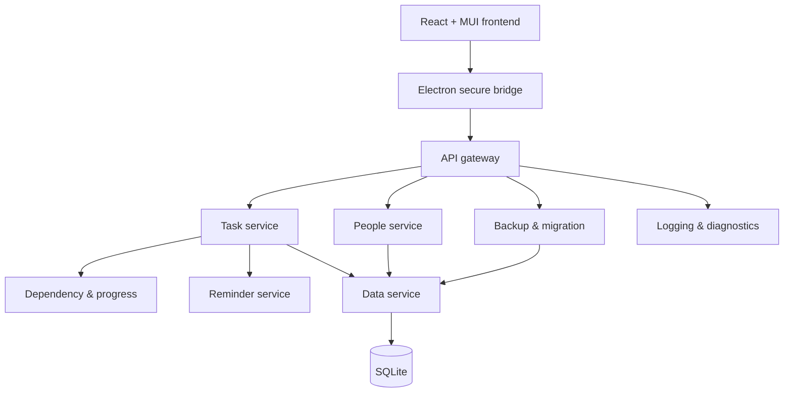
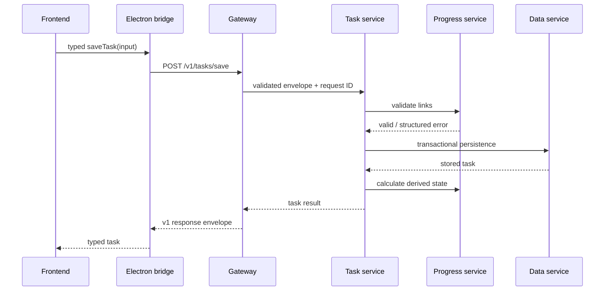
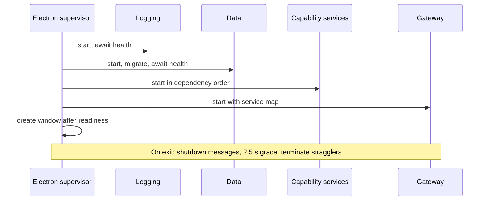

# Task Tracker architecture

## Service boundaries

Every box from API gateway downward is a separate operating-system process with an independent loopback listener and `/v1/health`. Electron starts and supervises them; they are not classes hosted inside Electron. Only Data imports `better-sqlite3`.

| Service | Responsibility | Failure boundary |
|---|---|---|
| Desktop shell | Windows window, dialogs, external links, notifications, supervision | Shows a recovery error if a critical service cannot start |
| API gateway | Single frontend entry, request IDs, routing, timeouts, error envelopes, aggregate health | Does not write data |
| Tasks | Task workflow, search orchestration, urgency, dashboard, project/person workload summaries, cross-service workflow | Reminder sync failure degrades gracefully |
| Dependency & progress | Cycle validation; automatic, manual, weighted, aggregate progress; urgency; dependency-load traversal and impact scoring | Invalid graph is rejected before persistence |
| People | Contact validation, duplicate-safe contact operations | Task viewing remains available if down |
| Reminders | Due/snoozed reminder state and recurrence scheduling boundary | Task CRUD continues if down |
| Backup & migration | Checksummed ZIP backup, validation, transactional restore/import, CSV/XLSX/JSON/PDF export | Safety backup precedes destructive operations |
| Logging & diagnostics | Structured JSONL logs, masking, filtering, export, safe diagnostics | Other services continue; supervisor fallback log remains |
| Data | Sole SQLite owner, migrations, repositories, transactions, integrity | Critical; bounded restart and clear recovery state |

## Communication flow

Transport is HTTP/JSON bound exclusively to `127.0.0.1`. Ports are assigned by the OS and retained for bounded restarts. Every call carries a random per-launch 256-bit token and correlation ID. The token stays in the Electron main process and supervised service environments; renderer code never receives it. Requests have size limits and timeouts. Browser origins other than the packaged app/development origin are rejected.

## Startup and shutdown

The supervisor retries a crashed service twice with increasing delay and the same loopback port. A non-critical reminder/log service can degrade without blocking task access. Exhausted critical-service retries produce a named recovery error. Shutdown is coordinated and kills stragglers to prevent orphan processes.

## Data ownership and consistency

- Only Data writes SQLite; Node's built-in SQLite module is used solely inside that process.
- Foreign keys, WAL, busy timeout, indexes, and migrations are enabled at initialization.
- Multi-row task/checklist/link writes, atomic prerequisite creation/conversion, and snapshot restores use transactions.
- Completion rules are enforced inside the Data transaction, including backup/import paths; React never decides whether completion is legal.
- Task operations use stable UUIDs across exports, backups, merge, and restore.
- Cross-service task saves validate dependencies before the Data transaction. Reminder synchronization happens after persistence and is retry-safe by task ID.
- Imports create a safety backup. Snapshot replacement occurs within one Data-service transaction.

## Contracts and events

All public service paths are `/v1/*`. `packages/contracts` defines Zod schemas, the common response/error envelope, health response, calendar/dependency/candidate requests, renderer diagnostics, and typed domain events. Supported event names include `task.created`, `task.completed`, `task.unblocked`, `progress.changed`, `backup.completed`, and `reminder.triggered`. Operations use stable task/event IDs so consumers can implement idempotency without duplicating reminders or history.

The calendar presentation read model is owned by Tasks with dependency state enriched by Dependency & Progress. Dependency-load traversal and scoring are owned by Dependency & Progress, with people/project records read through Data. The typed `GET /v1/workloads` contract returns project and person totals and progress; filtered task drill-downs use validated `TaskQueryInput` fields such as project, responsible person, exact due date, due window, status, priority, and blocked state. None of these features reads SQLite or recreates task eligibility rules in React.

## Failure and recovery strategy

- Timeout: abort at caller; return service name and correlation ID.
- Malformed input: reject at contract boundary before Data.
- Data lock/unavailable: SQLite busy timeout, no partial write, structured error, bounded process restart.
- Dependency calculation failure: task mutation is not sent to Data.
- Reminder failure: task remains saved; health shows degraded service and sync can retry.
- Backup failure: temporary file is not renamed; earlier backups remain intact.
- Restore/import failure: Data transaction rolls back; pre-operation safety backup remains.
- Logging failure: user operations continue and the shell uses a minimal fallback log.
- Shutdown during long work: existing complete file/database remains; `.tmp` output is never reported as a valid backup.

## Local and free operation

Services are bundled JavaScript processes launched through Electron's included runtime. Users install no Node.js, SQLite, Docker, broker, server, certificate, or background Windows service. There are no remote endpoints or paid runtime dependencies.
