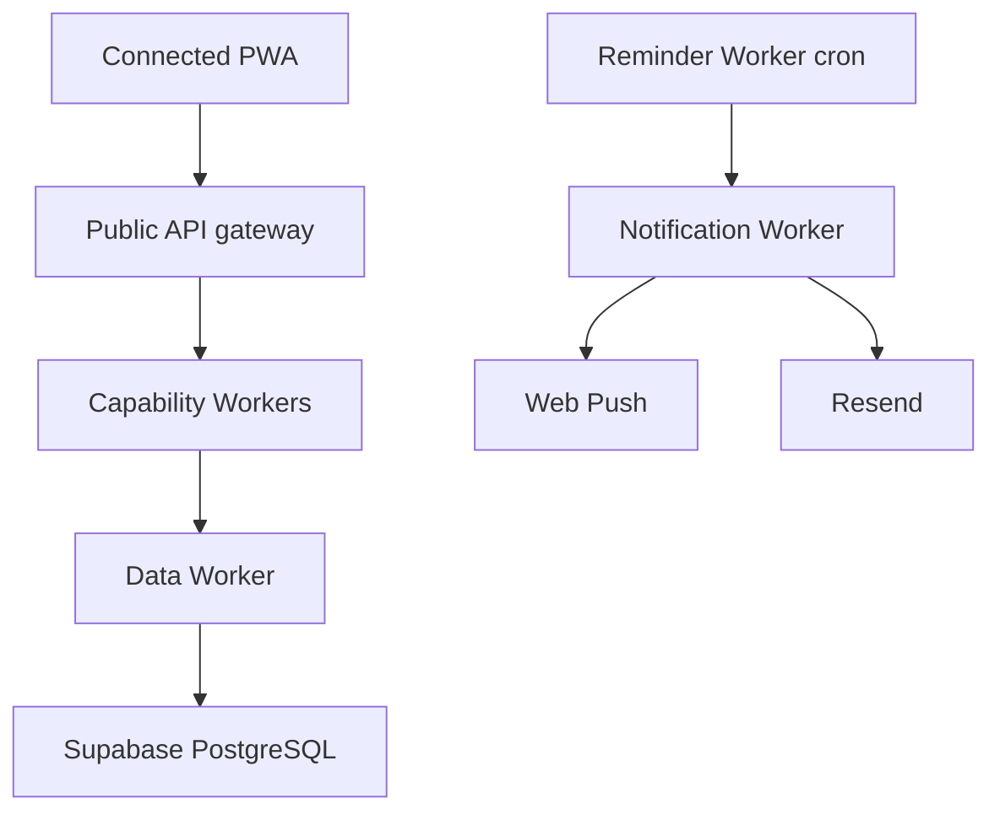

# Task Tracker Connected architecture

Task Tracker 1.4 contains two independently buildable products. **Local** remains the existing Electron shell, local gateway and seven capability services with the SQLite-owning Data service. It has no cloud dependency. **Connected** is an authenticated PWA and nine Cloudflare Workers backed by Supabase PostgreSQL. The editions never silently share data.

## Runtime boundaries

| Service | Public? | Responsibility | Database access |
| --- | --- | --- | --- |
| API gateway | Yes | Auth, owner allowlist, CORS, routing, request IDs, size/time limits | None |
| Tasks | No | Task queries, dashboard, calendar, project progress | Data binding only |
| People | No | People, function filter, person workload | Data binding only |
| Dependencies & progress | No | Cycle-safe graph operations, dependency load, atomic prerequisite workflows | Data binding only |
| Reminders | No | Bounded due-reminder claims, snooze, scheduled processing | Data binding only |
| Notifications | No | Web Push, Resend, subscriptions and preferences | Data binding only |
| Backup & export | No | Privacy-safe exports and one-way import preview/apply | Data binding only |
| Logging & diagnostics | No | Privacy-safe service health and audit events | Data binding only |
| Data | No | Sole application-data reader/writer; PostgREST/RPC allowlist | Supabase service role |

Worker service bindings keep internal services off public `workers.dev` routes. Every internal request requires a per-environment secret token and an authenticated workspace context. Only the gateway accepts browser traffic.

## Data and consistency

Every application row is scoped by a stable `workspace_id`, with RLS enabled. The Data Worker also supplies the workspace on every query. PostgreSQL functions implement atomic prerequisite create-and-link, circular-dependency rejection, required checklist and mandatory prerequisite completion guards, idempotent reminder claims, and transactional imports. `version` supports optimistic concurrency.

Calendar inclusion is limited to task due dates, incomplete checklist due dates, and task completion timestamps. Reminder and notification timestamps are delivery-only and never create Calendar cards or counts. Project and task start dates are intentionally excluded. Today is active tasks due today or overdue; priority alone never puts a future task in Today.

Dependency impact score is `affected tasks × 10 + affected projects × 20 + overdue prerequisites × 25 + critical/high affected tasks × 30 + indirect depth beyond one × 5`. Traversal keeps a visited path, stops at depth 50, and deduplicates prerequisite/affected-task/depth tuples.

## Offline and refresh

The service worker caches the shell. IndexedDB stores recent validated GET responses and only queues an explicit safe-write allowlist. Restore, permanent deletion, bulk destruction, and dependency graph changes are never queued. Writes have idempotency keys and version conflicts stop replay with visible refresh guidance. The app refreshes after writes, focus return, network return, and bounded page polling; Web Push handles time-sensitive background events.

## Product independence

`npm run build:local` requires no cloud variables. `npm run build:connected` requires no Electron process. Cloud keys are excluded from Electron Builder files. Local data moves to Connected only through an explicit backup export, validated dry run, and transactional import. Automatic two-way sync is deferred because it cannot yet guarantee conflict-safe graph and reminder changes.
