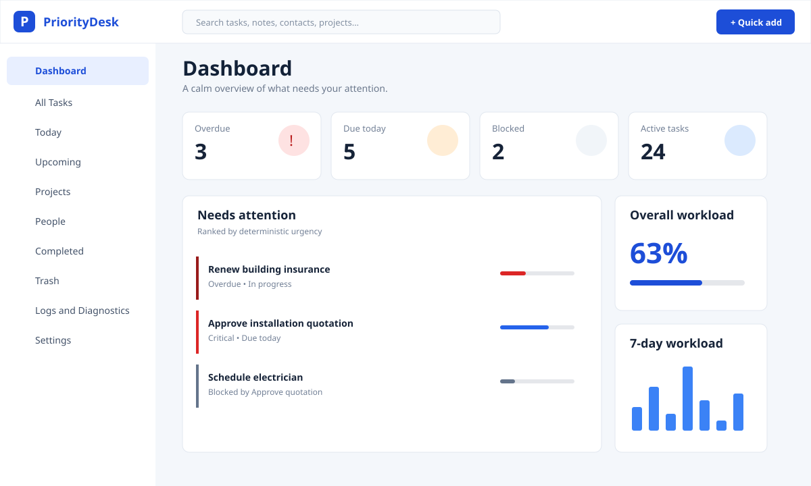

# Task Tracker user manual

## Get started

Open Task Tracker from the Start Menu. No login or internet connection is needed. Dashboard highlights overdue, due-today, critical, blocked, and waiting tasks. Hover or focus an information icon to read a card's counting rule. Select any metric, workload bar, overall-progress card, or project-progress row to open exactly the tasks represented by that object.

Press `Ctrl+N` or choose **Quick add** to capture a title, priority, and date. Choose **Save & add details** for the complete editor. The editor tabs contain Overview, **What needs to be done** checklist, Dependencies, People, Notes & files, and History. `Ctrl+F` focuses search; `Esc` closes a panel; unsaved edits trigger confirmation.

Progress modes are Automatic (equal checklist steps), Weighted (step weights), and Manual. Completed tasks show 100%. Colors reinforce—not replace—the visible status, priority, due date, and percentage.

To create a dependency, open the waiting task and choose Dependencies. Use **Link existing task** or **Create new prerequisite**. Task Tracker refuses self-links and indirect cycles. A blocked task names every incomplete prerequisite. See [Task Tracker 1.3 feature behavior](FEATURES_1_3.md) for checklist and completion rules.

People and Projects are reusable records. Project cards show progress across the project's current and completed tasks; People cards show the same measure for a person's complete assigned task load. Selecting either opens its filtered task list. All Tasks supports search, project and priority filters, smart/due/progress/title sorting, table/cards, multi-selection, bulk completion/archive, and recoverable deletion. Trash can restore tasks.

Today shows active tasks due today or earlier. A future task does not appear there merely because it is High/Critical priority or Waiting. Clear scheduling from a task's Overview using **Clear reminder and recurrence**, or clear the two fields individually and save.

## Backup or move computers

Open Settings → Backup and recovery → **Create backup**. Copy the resulting ZIP to the new computer. Install Task Tracker, choose **Validate or restore**, select the ZIP, review its checksum/date/version/counts, then choose Merge or Replace. Replace requires confirmation and creates a safety backup first.

The database is `%APPDATA%\PriorityDesk\prioritydesk.db`; default backups are under `%APPDATA%\PriorityDesk\backups`; logs are under `%APPDATA%\PriorityDesk\logs`. Do not manually edit the live database.

## Diagnostics and privacy

Logs and Diagnostics shows correlated service events and filter controls. **Diagnostic package** includes application/Windows versions, service health, masked technical logs, and recent failures. It excludes task descriptions, contacts, attachment contents, secrets, and credentials.

## Notifications

Enable notifications and optionally **Start with Windows** in Settings. Reminders can be shown while Task Tracker is running. Starting with Windows keeps local reminder scheduling available without a paid push service. If the app and its background processes are fully closed, notifications cannot fire.

## Installation note

The free build is unsigned, so SmartScreen may display an “unknown publisher” warning. Verify the installer came from your trusted build location, choose More info, and continue. Your user data is preserved during normal updates and uninstall by default.
